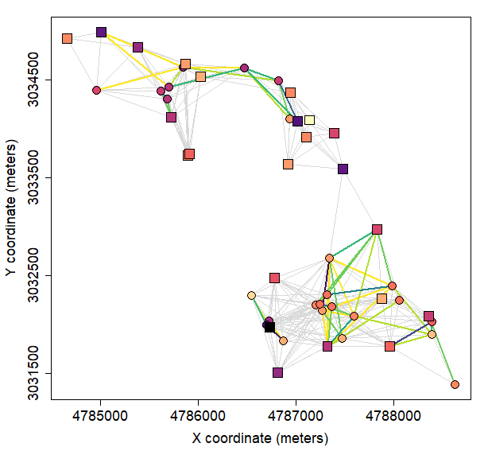

# `Resampler`: Technical Description of the Package

The `Resampler` package contains a single function, `resample_plots`, which performs a resampling (thinning) of vegetation plots based on a combination of geographic proximity and species composition similarity. The goal is to reduce sampling density in areas where many plots are located close to each other and record very similar or indentical vegetation.

The plot removal process is iterative: the function first identifies the most similar pair of plots within the specified distance, removes one of them based on a selected rule, and repeats this process until no pairs that violate the specified distance and similarity thresholds remain in the dataset.

The function is built on the highly optimized [`data.table`](https://github.com/Rdatatable/data.table) package and enables processing of large datasets (thousands and lower hundreds of thousands of plots) even on standard hardware.


## Installation

You can install the development version of `Resampler` directly from GitHub by running the following code in your R console:

```{r}
# Install devtools if you don't have it yet
if (!requireNamespace("devtools", quietly = TRUE)) {
  install.packages("devtools")
}

# Install and load Resampler
library(devtools)
install_github("jdivisek/Resampler")
library(Resampler)
```

## Data Requirements

The `resample_plots` function requires two input data objects in `data.table` format.

1.  `coord`

    A `data.table` containing coordinates and other metadata for each vegetation plot.

    - **Required columns:**

      - `PlotObservationID`: A unique identifier for each plot. It can be numeric, integer or character.

      - Second column: X-coordinate or Longitude. Must be of type numeric.

      - Third column: Y-coordinate or Latitude. Must be of type numeric.

    - **Rules:**

      - The coordinate columns must not contain any `NA` values.

      - Each `PlotObservationID` must be unique.

2.  `spec`

    A `data.table` containing vegetation data in "long format".

    - **Required columns:**

      - `PlotObservationID`: The plot identifier, which corresponds to the IDs in `coord`.

      - `Taxon_name`: The name of the recorded taxon (species).

      - `cover`: The species cover value (usually in %). Must be of type `numeric`.

    - **Rules:**

      - The `cover` column must not contain any `NA` and zero values.

      - All `PlotObservationID` present in `spec` must also be present in `coord` (and vice versa).

## Function Parameter Descriptions

- `coord`: A `data.table` containing plot coordinates and metadata. Must meet the requirements listed above.

- `spec`: A `data.table` containing species data. Must meet the requirements listed above.

- `longlat`: A logical value (`TRUE`/`FALSE`). If `TRUE`, coordinates are treated as latitude/longitude, and distances are calculated in kilometers. If `FALSE` (default), a projected coordinate system (e.g., UTM) is assumed, and distances are in meters.

- `dist.threshold`: A numeric value. The threshold for geographic distance. From a pair of plots closer than this value, one will be removed (if they also meet the `sim.threshold`). Units (meters/kilometers) depend on the `longlat` parameter. Default is `1000`.

- `sim.threshold`: A numeric value (0-1). The threshold for species composition similarity. From a pair of plots more similar than this value, one will be removed (if they also meet the `dist.threshold`). Default is `0.8`.

- `sim.method`: The method for calculating similarity. Options: `"bray"` (Bray-Curtis), `"simpson"` (Simpson), `"sorensen"` (Sørensen), `"jaccard"` (Jaccard). For all methods except `"bray"`, cover data is automatically converted to presence/absence.

- `remove`: The rule that decides which plot from a conflicting pair will be removed. Default is `"random"`.

  - `"random"`: Randomly removes one of the two plots.

  - `"less diverse"`: Removes the plot with the lower number of species. Ties are broken by `"random"` order.

  - `"more diverse"`: Removes the plot with the higher number of species. Ties are broken by `"random"` order.

  - `"lower var.value"`: Removes the plot with the lower value in the column defined by the `var.value` parameter. `NAs` are allowed and plots with `NA` are removed first.

  - `"higher var.value"`: Removes the plot with the higher value in the column defined by the `var.value` parameter. `NAs` are allowed and plots with `NA` are removed first.

- `var.value`: A character string. The name of a column in `coord` used for decision-making with the `"lower var.value"` and `"higher var.value"` methods. `NAs` are allowed in this variable and plots with `NA` are removed first.

- `strata`: A character string. The name of a column in `coord` that defines plot stratification. If provided, resampling is performed separately within each stratum (group).

- `seed`: A number. The seed value for the random number generator, which ensures reproducibility of results for the `"random"` method. Default is `1234`.

## Technical Description of Internal Workflow

The function operates in the following steps:

1.  **Data Preparation and Validation:** A series of checks is performed to verify that the input data meet all requirements regarding format, type, and the absence of `NA` values.

2.  **Data Preparation and Sorting:** This key step ensures reproducibility and efficiency.

    - First, the `coord` data.table is sorted according to the rule defined in `remove`. For `"random"`, the rows are randomly shuffled. For other methods, they first randomly shuffled and then sorted by diversity or the value in `var.value`. This serves as a **universal tie-breaking rule** in subsequent steps.

    - Based on this final order, a new, internal numeric identifier `id` (1, 2, 3...) is created and joined to the `spec` table. All further operations work with this `id`.

3.  **Neighbor Identification:** Using the `spdep::dnearneigh` function, a list of neighbors within the `dist.threshold` is found for each plot. If stratification is used, neighbors are only searched for within the same stratum.

4.  **Splitting into Groups:**

    - A graph is created from the list of neighbors (using `igraph`).

    - The `igraph::components` function analyzes this graph and divides all plots into independent, geographically contiguous groups (components).

5.  **Resampling:** The actual resampling process is performed for each group individually.

    - For the given group, similarity between neighboring plots is calculated and a list of all unique pairs of plots that are both geographically close (i.e. neighboring) and exceed the similarity threshold is created.

    - This list of "conflicting" pairs is sorted in descending order based on their compositional similarity.

    - The script then iterates through this sorted list, starting with the most similar pair. For the first pair in the list, it decides which plot to remove based on the `remove` rule and adds it to a "blacklist". Subsequently, it removes ALL pairs from the list that contained this just-removed plot. The process is repeated on the reduced list until no conflicting pairs remain.

      

      The figure above shows resampling within a geographically contiguous group of 48 vegetation plots containing 265 plant species. With `dist.threshold = 1000`, the Simpson similarity was calculated for all 306 pairs of neighboring plots (gray lines). Of these, 55 pairs exceeded `sim.threshold = 0.5`. Plot similarity above this threshold is indicated by viridis line color – the darker the color, the higher the similarity. With `remove = "less diverse"`, the plot with lower species richness was removed from each pair that exceeds both `dist.threshold` and `sim.threshold`. Species richness of each plot is indicated by magma colors – the darker the color, the higher the species richness. The resampling resulted in the removal of 25 plots (circles), while 23 species-richer plots (squares) were preserved.

6.  **Result:** The blacklists of removed plots from all groups are combined. Based on this final blacklist, the original `coord` is filtered, and the thinned and cleaned `data.table` is returned.

## Example with Real Data

To see a practical example of resampling vegetation plots from the Czech Vegetation Database, visit: <https://czechveg.github.io/DataProcessingTutorial/data_resampling.html>

## Performance Notes

The function can process very large datasets (lower hundreds of thousands of plots) but its actual performance critically depends on parameters set:

- `dist.threshold` value is the most important. The larger the value, the larger the geographically contiguous groups of plots are processed. For example, when setting `dist.threshold = 1000` for grassland vegetation plots from the European Vegetation Archive, the largest group contained more than 29,000 plots! Depending on the actual size of the dataset, it is therefore recommended to set the `dist.threshold` value no higher than 5,000 m. For smaller datasets, large distances can be set, but they are not ecologically very meaningful. For large datasets, high distance values increase processing time and can cause memory issues.

- `sim.threshold` value is another important parameter that influences the performance of the function, but it is not as critical as `dist.threshold`. Setting a very low similarity value will result in fewer preserved plots, and vice versa.

- `longlat`. Although the `spdep::dnearneigh` function, which is used to identify neighboring plots, can handle geographical coordinates in degrees, it is highly recommended to provide coordinates in a projected coordinate system such as ETRS89 and set `longlat = FALSE`. In this case, the function uses Euclidean distance instead of Great Circle distance, which speeds up the identification of neighboring plots.

The function was tested with a dataset containing 468,341 grassland vegetation plots from the [European Vegetation Archive](https://euroveg.org/eva-database/) using the following settings: `longlat = FALSE`, `dist.threshold = 1000`, `sim.threshold = 0.8`, `sim.method = "simpson"`, `remove = "random"`, and `strata = NULL`. On an older PC with 8 GB RAM and an Intel Core i5-9400F 2.8 GHz processor, resampling took 20 hours and 53 minutes without any memory issues. Therefore, you should be patient😉. The resampling removed 30.9% of plots (144,860 out of 468,341).

The function was also tested with a smaller dataset of 114,854 plots from the [Czech Vegetation Database](https://czechveg.github.io/) using the following settings: `longlat = FALSE`, `dist.threshold = 1000`, `sim.threshold = 0.5`, `sim.method = "simpson"`, `remove = "random"`, and `strata = NULL`. On a laptop with 32 GB RAM and an Intel Core i7-11850H 2.5 GHz processor, the resampling procedure took 8 minutes. When using environmental strata, the resampling took less than 3 minutes.

Although faster implementations of this resampling procedure in R are certainly possible, especially for small datasets, they require calculating pairwise similarity matrices, which becomes very memory-demanding and inefficient with large datasets.
